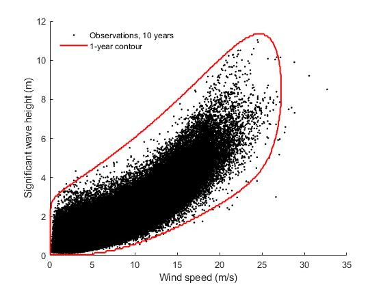

# compute-hdc: Highest density contour method in Matlab

A software to compute a highest density (environmental) contour.

A highest density (HD) contour is one possible definition for an environmental 
contour. This definition has been proposed by Haselsteiner, Ohlendorf, 
Wosniok and Thoben (2017; http://doi.org/10.1016/j.coastaleng.2017.03.002)

This software involves a couple of .m files for computing a HD contour: 
* `computeHdc`: Computes the contour. It needs a probabilistic model, 
an exceedance probability and a grid as its input.
* `computeHdcExampleWithCMA`: Cotains examples how to use `computeHdc`.
* `getProbabilisticModel`: Returns some sample probabilistic models, 
which can be used with `computeHdc`. 
* The other functions are subroutines needed for `computeHdc`.
* `computeIFormContour` computes an IFORM environmental contour, which is 
 another environmental contour concept.

If you are using this software in your academic work please cite it as 
A.F. Haselsteiner (2020): compute-hdc: Highest density contour method in 
Matlab (version 1.2.0; https://github.com/ahaselsteiner/compute-hdc).

(if you are using version 1.1.1)
